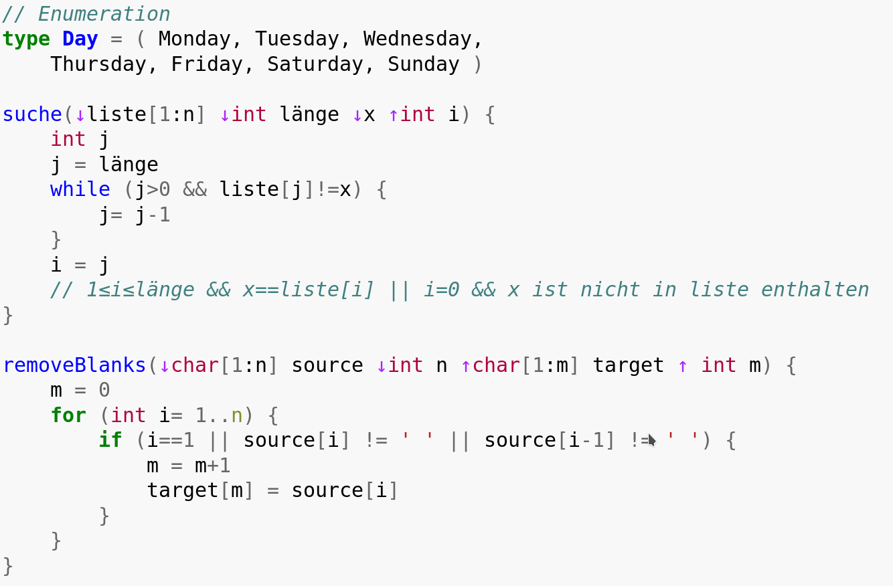

# pygments-jana

This project aims to implement a pygments plugin to highlight
the algorithm design language [Jana](https://de.wikipedia.org/wiki/Jana_(Informatik)).

## Example

## Installing 

### Developer Mode

    sudo python setup.py develop

## Ressources for writing pygments plugins

  * https://stackoverflow.com/questions/22321702/how-to-install-a-new-lexer-in-pygments
  * http://www.iamjonas.me/2013/03/custom-syntax-in-pygments.html
